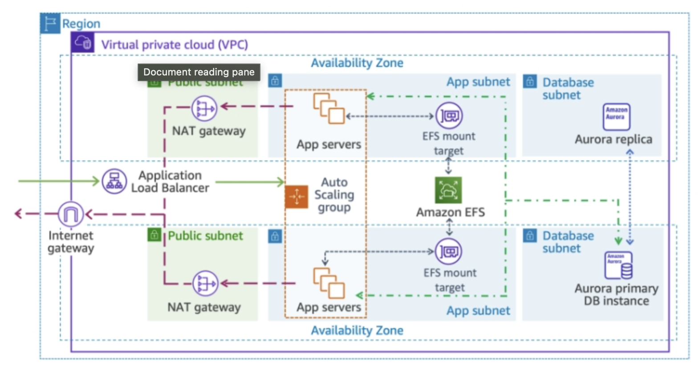

# AWS-Terraform

```bash
terraform init
terraform plan -out=tfplan
terraform apply tfplan
terraform destroy -auto-approve
```

# Project 1

## Target:


## Structure:

- Main modules:
    - VPC
    - IGW
    - Security Group HTTP
    - Route Table to IGW
- AZ Modules:
    - Subnet public in AZ1 & AZ2
    - NAT Gateway in public subnet
    - Instances in private subnets
    - EFS Mount
- ALB
- Global Accelerator
- Memory:
    - EFS
    - DB Aurora AZ1
    - DB Aurora Replica AZ2


# ---


#-----------------------------